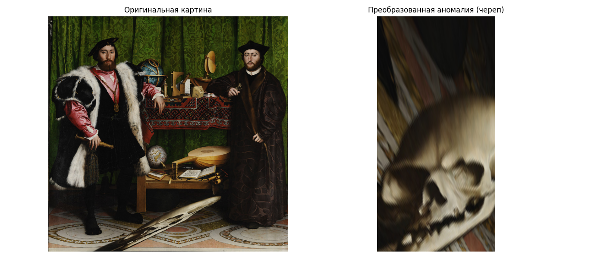

# CV Anomaly Project

Проект по обработке искажённых изображений и аномалий в картинах с помощью **OpenCV** и **Python**.  
Основная цель — применение **перспективных преобразований** для восстановления «нормального» вида фрагментов изображений (например, аноморфоз у Гольбейна или фрески Рафаэля).

---

##  Содержание

1. **Ambassadors (1533)** — Ганс Гольбейн Младший  
   - Поиск аномалии (черепа) на картине  
   - Перспективное преобразование (выпрямление анаморфозы)

2. **Stanza della Segnatura — Рафаэль Санти**  
   - Получение нормализованных изображений:
     - фреска *Парнас*  
     - фреска *Афинская школа*  
     - пол комнаты  

3. **Интерактивные инструменты**
   - Клик мышкой для выбора четырёх углов перспективной области  
   - Автоматическое сохранение выпрямленного фрагмента

---

##  Технологии

- **Python 3.10+**
- **OpenCV (cv2)**
- **NumPy**
- **Matplotlib**

---

## Результаты 

